# three-readme — camo 再生テスト

GitHub の ``（camo 経由）で、headless SVGRenderer が焼いた **SMIL アニメSVG** が再生されるかを確認するための捨てリポジトリ用 README。

判定基準：下の図がブラウザ（手元）と同じく GitHub 上でも回っていれば論点2はクリア。静止画で固まっていたら GitHub 側がアニメを潰している。

> 注：初版は CSS `steps()` 方式で、SVGO の `inlineStyles` が `animation` 本体を落として全フレーム重なり表示になっていた。SMIL `<animate>`（opacity の one-hot 切替）に変更し、SVGO もアニメ非破壊プラグインのみに絞って再生成済み。

## 1. Markdown 埋め込み（本命）

torus knot / 24フレーム / ~113KB

icosahedron / 36フレーム / ~53KB

## 2. HTML `` 埋め込み（幅指定の確認）

  
  

## チェックリスト

- [ ] markdown 埋め込みで再生される
- [ ] HTML `` + width 指定で再生される
- [ ] ダーク／ライト両テーマで視認できる（現状 stroke 固定色 `#4f9cff`）
- [ ] モバイル（GitHub アプリ）でも再生される

## メモ

- 生成物コミット方式（`snk` と同型）。README は `` 1行のみ。
- 差し替え後に絵が変わらない場合は camo キャッシュ。URL に `?v=2` を付けて確認。
- 今回の教訓：アニメを `<style>`/CSS に置くと SVGO とサニタイズの両方で壊れやすい。SMIL 属性に寄せるのが堅い。
